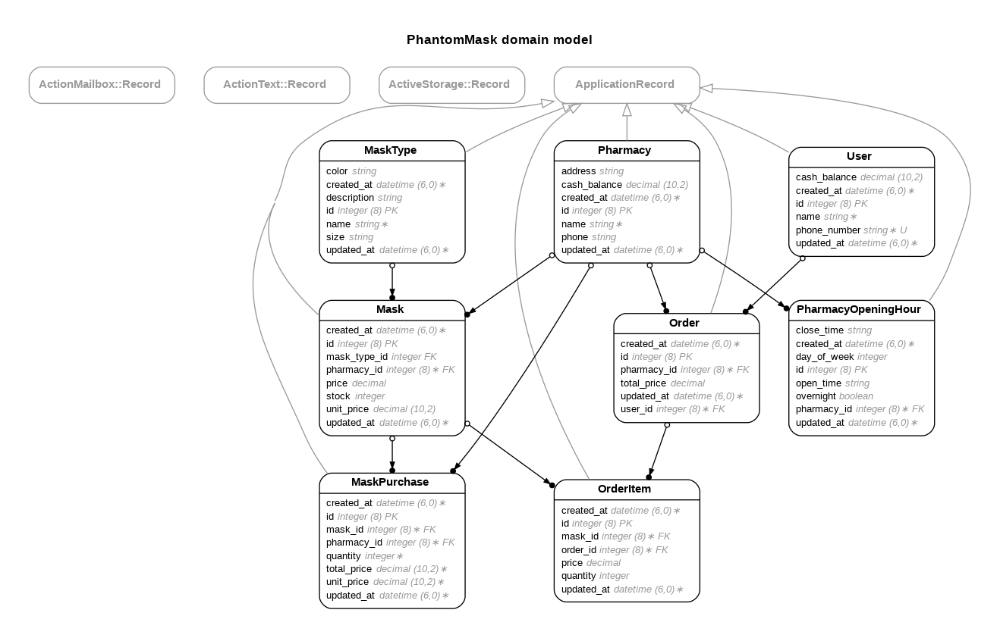

## A. Required Information
### A.1. Requirement Completion Rate
- [x] List all pharmacies open at a specific time and on a day of the week if requested.
  - Implemented at `/api/pharmacies?day_of_week={0-6}&time=HH:mm`
  - Test : [http://35.229.247.36:3000/api/pharmacies?day_of_week=1&time=14:00](http://35.229.247.36:3000/api/pharmacies?day_of_week=1&time=14:00)
- [x] List all masks sold by a given pharmacy, sorted by mask name or price.
  - Implemented at `/api/pharmacies/:pharmacy_id/masks?sort=price_asc`
  - Test : [http://35.229.247.36:3000/api/pharmacies/1/masks?sort=price_asc](http://35.229.247.36:3000/api/pharmacies/1/masks?sort=price_asc)
  - Implemented at `/api/pharmacies/:pharmacy_id/masks?sort=price_desc`  
  - Test : [http://35.229.247.36:3000/api/pharmacies/1/masks?sort=price_desc](http://35.229.247.36:3000/api/pharmacies/1/masks?sort=price_desc)
  - Implemented at `/api/pharmacies/:pharmacy_id/masks?sort=name_asc`  
  - Test : [http://35.229.247.36:3000/api/pharmacies/1/masks?sort=name_asc](http://35.229.247.36:3000/api/pharmacies/1/masks?sort=name_asc)
  - Implemented at `/api/pharmacies/:pharmacy_id/masks?sort=name_desc`  
  - Test : [http://35.229.247.36:3000/api/pharmacies/1/masks?sort=name_desc](http://35.229.247.36:3000/api/pharmacies/1/masks?sort=name_desc)
- [x] List all pharmacies with more or less than x mask products within a price range.
  - Implemented at `/api/pharmacies/filter_by_mask_conditions?mask_price_min=5&mask_price_max=20&stock_gt=2&stock_lt=6`
  - Test : [http://35.229.247.36:3000/api/pharmacies/filter_by_mask_conditions?mask_price_min=5&mask_price_max=20&stock_gt=2&stock_lt=6](http://35.229.247.36:3000/api/pharmacies/filter_by_mask_conditions?mask_price_min=5&mask_price_max=20&stock_gt=2&stock_lt=6)
- [x] The top x users by total transaction amount of masks within a date range.
  - Implemented at `/api/orders/analytics/top_users?start_date=YYYY-MM-DD&end_date=YYYY-MM-DD&limit=x`
  - Test : [http://35.229.247.36:3000/api/orders/analytics/top_users?start_date=2021-01-01&end_date=2021-01-31&limit=3](http://35.229.247.36:3000/api/orders/analytics/top_users?start_date=2021-01-01&end_date=2021-01-31&limit=3)
- [x] The total number of masks and dollar value of transactions within a date range.
  - Implemented at `/api/orders/analytics/statistics?start_date=YYYY-MM-DD&end_date=YYYY-MM-DD`
  - Test : [http://35.229.247.36:3000/api/orders/analytics/statistics?start_date=2021-01-01&end_date=2021-01-31](http://35.229.247.36:3000/api/orders/analytics/statistics?start_date=2021-01-01&end_date=2021-01-31)
- [x] Search for pharmacies or masks by name, ranked by relevance to the search term.
  - Implemented at `/api/pharmacies?keyword=xxx`
  - Test : [http://35.229.247.36:3000/api/pharmacies?keyword=M](http://35.229.247.36:3000/api/pharmacies?keyword=M)
  - Implemented at `/api/mask_types?keyword=xxx`
  - Test : [http://35.229.247.36:3000/api/mask_types?keyword=green](http://35.229.247.36:3000/api/mask_types?keyword=green)
- [x] Process a user purchases a mask from a pharmacy, and handle all relevant data changes in an atomic transaction.
  - Implemented at `/api/orders`
### A.2. API Document
📄 **API Documentation:**  
[http://35.229.247.36:3000/api-docs/index.html](http://35.229.247.36:3000/api-docs/index.html)

📥 **Postman Collection:**  
Import [`allen_postman_collection.json`](./public/allen_postman_collection.json) into Postman to explore and test the APIs.

### A.3. Import Data Commands
Please run these two script commands to migrate the data into the database.

```bash
$ rake import_data:pharmacies[PATH_TO_FILE]
$ rake import_data:users[PATH_TO_FILE]
```
## B. Bonus Information

>  If you completed the bonus requirements, please fill in your task below.
### B.1. Test Coverage Report

I wrote **69 unit tests** for the APIs I built. 

You can check the test coverage report:

- 📁 **Local file path:** `/public/coverage/index.html`
- 🌐 **Online report:** [http://35.229.247.36:3000/coverage](http://35.229.247.36:3000/coverage)

To run the test suite and generate the coverage report, use the following command:

```bash
bundle exec rspec spec
```

### B.2. Dockerized
Please check my [Dockerfile](Dockerfile) / [docker-compose.yml](docker-compose.yml)

To run the project locally using Docker, follow the steps below:

#### 🛠️ Environment Setup

1. Copy the example database configuration file:
   ```bash
   cp config/database.yml.example config/database.yml
   ```

2. Create a `.env` file in the project root and add the following environment variables:
   ```env
   DB_USERNAME=phantom
   DB_PASSWORD=phantom1234
   DB_HOST=db
   ```
3. 🚀 Build & Start   
   ```bash
   $ docker-compose build --no-cache 
   $ make setup
   $ make start
   ```

### B.3. Demo Site Url

The demo site is ready on [my GCP demo site](http://35.229.247.36:3000/api-docs/index.html); you can try any APIs on this demo site.

## C. Other Information

### C.1. ERD

My ERD:


### C.2. Technical Document

For frontend programmer reading, please check this [Swagger API Documentation](http://35.229.247.36:3000/api-docs) to know how to operate those APIs.

- --
